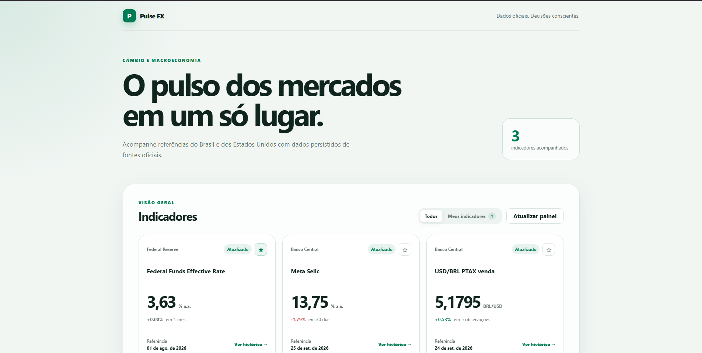
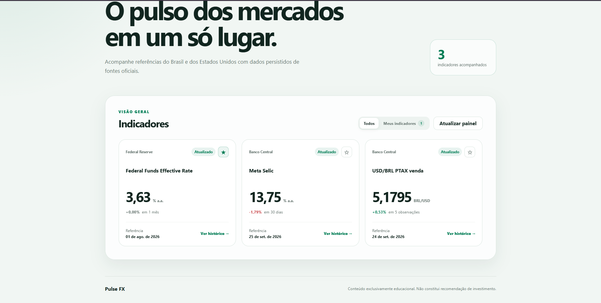
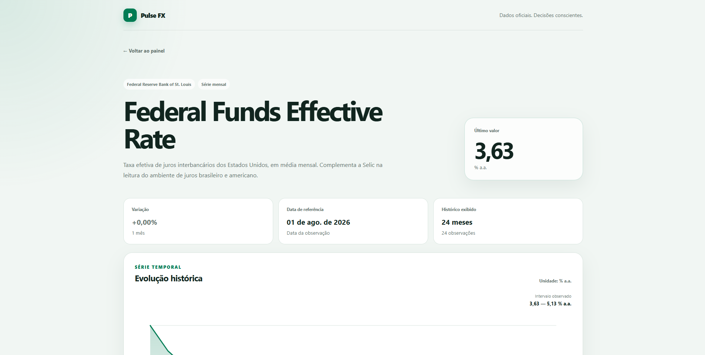
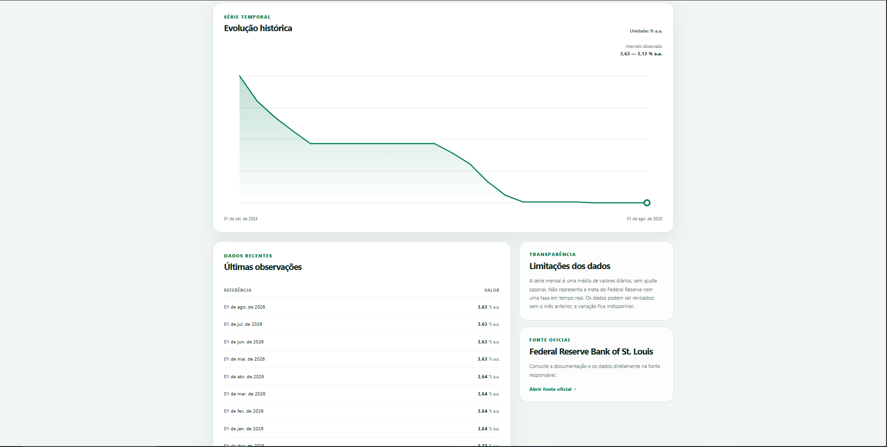

# Pulse FX

MVP full stack para acompanhar câmbio e indicadores macroeconômicos a partir de fontes públicas. A aplicação reúne dados do Banco Central do Brasil (BCB) e do Federal Reserve Economic Data (FRED), persiste as observações em PostgreSQL e oferece dashboard, detalhe histórico e favoritos por visitante.

> Conteúdo exclusivamente educacional e informativo. Não constitui recomendação de investimento.

## Funcionalidades

- Dashboard responsivo com último valor, data de referência e variação percentual.
- Detalhe do indicador com gráfico, tabela, fonte e limitações dos dados.
- Favoritos persistidos no backend para um identificador anônimo do visitante.
- Sincronização periódica com TTL, prevenção de concorrência e isolamento de falhas por provedor.
- API própria com validação de entrada e respostas de erro controladas.
- Ambiente completo com Docker Compose, migrations e seed versionados.
- Pipeline de CI com lint, tipagem, testes, build e validação das imagens.

## Demonstração

### Dashboard





### Detalhe do indicador





## Stack

- **Web:** React 19, TypeScript e Vite.
- **API:** Node.js 22, TypeScript e Fastify.
- **Dados:** PostgreSQL 17 e Prisma ORM.
- **Testes:** Vitest, Testing Library e Fastify `inject`.
- **Infraestrutura:** Docker, Docker Compose e Nginx.
- **Monorepo:** pnpm workspaces.

## Arquitetura

```text
pulse-fx/
├── apps/
│   ├── api/
│   │   ├── prisma/                 # schema e migrations
│   │   └── src/
│   │       ├── config/             # validação de ambiente
│   │       ├── database/           # cliente, catálogo e seed
│   │       ├── jobs/               # sincronização e agendamento
│   │       └── modules/
│   │           ├── indicators/     # domínio, aplicação, HTTP e infraestrutura
│   │           └── favorites/      # aplicação, HTTP e persistência
│   └── web/
│       └── src/
│           ├── features/           # indicadores e favoritos
│           └── lib/                # cliente HTTP e navegação
├── packages/
│   └── contracts/                  # espaço para contratos compartilhados
├── docker-compose.yml
└── pnpm-workspace.yaml
```

Na API, o domínio contém as regras puras de comparação e variação. A camada de aplicação coordena casos de uso por interfaces de repositório; HTTP trata transporte e validação; infraestrutura implementa PostgreSQL e os provedores externos. Essa separação permite testar a regra de negócio sem rede ou banco reais.

O frontend é organizado por funcionalidade. O cliente chama `/api` em desenvolvimento e produção: o Vite encaminha para a API local e o Nginx faz o proxy entre os containers.

## Indicadores e fontes

| Indicador | Fonte | Frequência | Por que está no produto |
| --- | --- | --- | --- |
| USD/BRL PTAX venda | [BCB PTAX](https://dadosabertos.bcb.gov.br/dataset/taxas-de-cambio-todos-os-boletins-diarios) | Diária | Referência oficial para acompanhar a evolução do dólar em reais e contextualizar custos internacionais. Não é cotação em tempo real nem preço final ao consumidor. |
| Meta Selic | [BCB SGS — série 432](https://dadosabertos.bcb.gov.br/dataset/432-taxa-de-juros---meta-selic-definida-pelo-copom) | Diária | Contextualiza a política monetária e o ambiente de juros brasileiro. É a meta definida pelo Copom, não a taxa efetiva de uma operação. |
| Federal Funds Effective Rate | [FRED — FEDFUNDS](https://fred.stlouisfed.org/series/FEDFUNDS) | Mensal | Permite comparar o ambiente de juros dos Estados Unidos com o brasileiro. A série é uma média mensal, sem ajuste sazonal, e não representa a meta do Federal Reserve. |

Documentação de referência: [BCB Dados Abertos](https://dadosabertos.bcb.gov.br/), [BCB Olinda/PTAX](https://olinda.bcb.gov.br/olinda/servico/PTAX/versao/v1/swagger-ui3/) e [FRED API](https://fred.stlouisfed.org/docs/api/fred/).

## Regras de variação e histórico

A variação é calculada como:

```text
((valor mais recente - valor base) / valor base) * 100
```

| Indicador | Valor base da variação | Janela exibida | TTL |
| --- | --- | --- | --- |
| USD/BRL PTAX | Quinta observação válida anterior | 3 meses | 6 horas |
| Meta Selic | Última observação disponível em ou antes de 30 dias corridos atrás | 3 meses | 6 horas |
| Fed Funds | Observação do mês-calendário anterior | 24 meses | 24 horas |

O último valor é sempre a observação válida mais recente persistida. A data mostrada é a data de referência dessa observação, não o horário da consulta. Fins de semana, feriados e lacunas não são interpolados: a comparação usa dados efetivamente publicados. Se não existir base adequada ou o denominador for zero, a variação fica indisponível.

## Sincronização

A API inicia um ciclo de sincronização ao subir e o repete no intervalo definido por `SYNC_INTERVAL_MINUTES`. Antes de consultar uma fonte, verifica o TTL individual do indicador; dados ainda frescos não geram nova chamada.

Cada indicador usa um advisory lock transacional do PostgreSQL, evitando sincronizações concorrentes em múltiplas execuções. As observações são gravadas por `upsert`, tornando a operação idempotente. Uma falha em um provedor é registrada e não impede os demais provedores de sincronizar.

Também é possível executar cada integração manualmente:

```bash
pnpm --filter @pulse-fx/api sync:ptax
pnpm --filter @pulse-fx/api sync:selic
pnpm --filter @pulse-fx/api sync:fred
```

## Favoritos

O navegador cria um UUID anônimo e o mantém no armazenamento local. Esse identificador é enviado no header `x-visitor-id`; a relação entre visitante e indicador é persistida no PostgreSQL. As operações de adicionar e remover são idempotentes. Não há autenticação nem coleta de dados pessoais neste MVP.

## Executando com Docker Compose

### Pré-requisitos

- Docker com Docker Compose.
- Uma [chave de API do FRED](https://fredaccount.stlouisfed.org/apikeys).

### Inicialização

Na raiz do projeto:

```powershell
Copy-Item .env.example .env
```

Preencha `FRED_API_KEY` no arquivo `.env` e execute:

```powershell
docker compose up --build -d
docker compose ps -a
```

O serviço `bootstrap` deve terminar com status `Exited (0)`. Ele aplica as migrations e executa o seed antes da inicialização da API.

Acesse:

- Aplicação: <http://127.0.0.1:8081>
- Health do frontend: <http://127.0.0.1:8081/health>
- Health da API pelo proxy: <http://127.0.0.1:8081/api/health>

O `.env.example` usa `WEB_PORT=8081`. A porta pode ser alterada no `.env` se estiver ocupada.

Para acompanhar os logs ou encerrar o ambiente:

```powershell
docker compose logs -f api web
docker compose down
```

Use `docker compose down -v` apenas quando quiser também remover permanentemente o volume local do PostgreSQL.

## Executando em desenvolvimento

### Pré-requisitos

- Node.js 22 ou superior.
- pnpm 10.24.0.
- PostgreSQL; o container do projeto pode ser usado localmente.

Instale as dependências e prepare o ambiente:

```powershell
corepack enable
pnpm install --frozen-lockfile
Copy-Item .env.example .env
docker compose up -d postgres
pnpm --filter @pulse-fx/api db:deploy
pnpm --filter @pulse-fx/api db:seed
```

Depois de informar `FRED_API_KEY` no `.env`, use dois terminais:

```powershell
pnpm dev:api
```

```powershell
pnpm dev:web
```

- Web: <http://127.0.0.1:5173>
- API: <http://127.0.0.1:3333>
- Health da API: <http://127.0.0.1:3333/health>

## Variáveis de ambiente

| Variável | Obrigatória | Padrão no exemplo | Descrição |
| --- | --- | --- | --- |
| `FRED_API_KEY` | Sim | vazio | Chave usada para consultar a API FRED. |
| `DATABASE_URL` | Sim no desenvolvimento | PostgreSQL local na porta 5433 | Conexão usada por Prisma e API fora do Compose. |
| `API_HOST` | Não | `0.0.0.0` | Interface em que a API escuta. |
| `API_PORT` | Não | `3333` | Porta publicada pela API. |
| `SYNC_INTERVAL_MINUTES` | Não | `15` | Intervalo do scheduler; o TTL ainda controla chamadas externas. |
| `POSTGRES_USER` | Sim no Compose | `pulse_fx` | Usuário do PostgreSQL. |
| `POSTGRES_PASSWORD` | Sim no Compose | `pulse_fx_local` | Senha local; troque fora do ambiente de desenvolvimento. |
| `POSTGRES_DB` | Sim no Compose | `pulse_fx` | Banco criado pelo container. |
| `POSTGRES_PORT` | Não | `5433` | Porta PostgreSQL publicada no host. |
| `WEB_PORT` | Não | `8081` | Porta do frontend publicada no host. |

Nunca versione o `.env` nem uma chave FRED real.

## API

| Método | Rota | Descrição |
| --- | --- | --- |
| `GET` | `/health` | Verifica a disponibilidade da API. |
| `GET` | `/v1/indicators` | Retorna os resumos do dashboard. |
| `GET` | `/v1/indicators/:slug` | Retorna metadados e histórico de um indicador. |
| `GET` | `/v1/favorites` | Lista favoritos do visitante. |
| `PUT` | `/v1/favorites/:slug` | Adiciona um favorito de forma idempotente. |
| `DELETE` | `/v1/favorites/:slug` | Remove um favorito de forma idempotente. |

As rotas de favoritos exigem um UUID válido no header `x-visitor-id`. No ambiente Docker, prefixe as rotas da API com `/api` ao acessá-las pela porta do frontend.

Exemplo:

```powershell
$visitorId = [guid]::NewGuid().ToString()
$headers = @{ 'x-visitor-id' = $visitorId }

Invoke-RestMethod -Uri 'http://127.0.0.1:8081/api/v1/indicators'
Invoke-WebRequest -Method Put -Uri 'http://127.0.0.1:8081/api/v1/favorites/usd-brl-ptax' -Headers $headers
Invoke-RestMethod -Uri 'http://127.0.0.1:8081/api/v1/favorites' -Headers $headers
```

## Qualidade e testes

Execute toda a validação do monorepo:

```powershell
pnpm lint
pnpm typecheck
pnpm test
pnpm build
pnpm audit --prod
```

A suíte atual contém testes de domínio, aplicação, provedores externos, scheduler, rotas HTTP, navegação, formatação e componentes React. As integrações externas são testadas com clientes controlados; os testes não dependem da disponibilidade do BCB ou FRED.

O workflow em `.github/workflows/ci.yml` executa lint, tipagem, testes e build, seguido da validação e construção das imagens Docker, em pull requests e pushes para `master`.

## Decisões e trade-offs

- **Monorepo com pnpm:** mantém web, API e contratos próximos, com comandos únicos de qualidade.
- **Identidade anônima para favoritos:** entrega persistência real sem ampliar o escopo para autenticação; limpar o armazenamento local cria uma nova identidade.
- **Polling agendado com TTL:** adequado à frequência diária/mensal dos dados e mais simples que uma fila para este MVP.
- **Sem interpolação:** evita apresentar valores artificiais em feriados, fins de semana ou lacunas.
- **Gráfico SVG próprio:** reduz dependências e atende ao histórico pequeno; uma biblioteca especializada seria preferível para zoom, acessibilidade avançada ou grandes volumes.
- **Sem endpoint administrativo de sincronização:** reduz superfície de ataque; jobs manuais ficam disponíveis por CLI.
- **Catálogo no seed:** decisões de produto, TTL e estratégias permanecem explícitas e versionadas.

## Limitações conhecidas

- A disponibilidade e possíveis revisões dos dados dependem das fontes externas.
- O primeiro ciclo precisa de acesso ao BCB e FRED para preencher as observações.
- Favoritos não são sincronizados entre navegadores ou dispositivos.
- O MVP não oferece autenticação, alertas, exportação ou atualização em tempo real.
- Não há trading, ordens, pagamentos ou recomendação de investimento.

## Uso do projeto

Projeto demonstrativo de caráter técnico. O nome Pulse FX e os materiais deste repositório não se destinam à exploração comercial.
